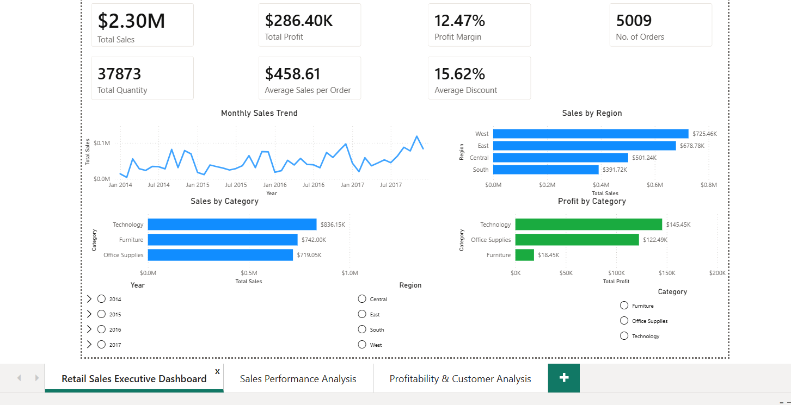
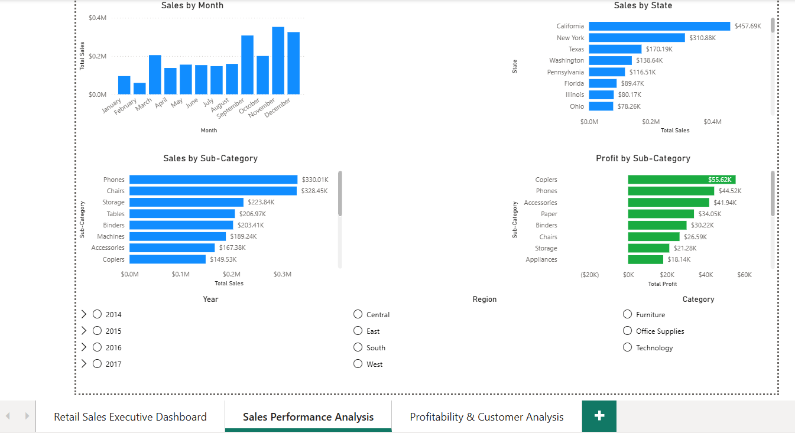
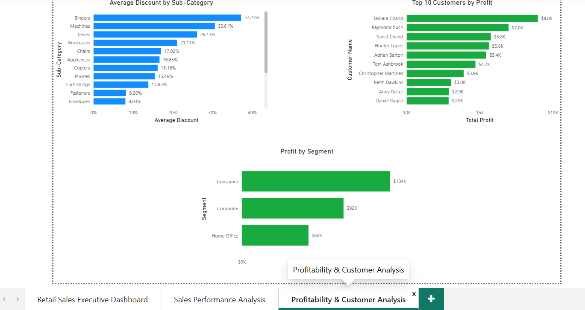
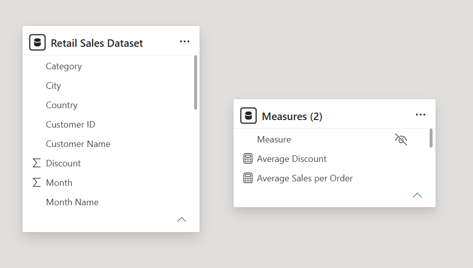

# Retail Sales Analytics

## Project Overview

This project presents an end-to-end analysis of retail sales data using Power BI, SQL, and Python. The analysis focuses on evaluating sales performance, profitability, customer value, regional performance, monthly sales trends, and discount patterns.

The objective is to transform transactional retail data into actionable business insights and identify key factors influencing overall business performance.

## Business Objectives

The analysis aims to answer the following key business questions:

- How are overall sales and profit performing?
- Which product categories generate the highest sales and profit?
- Which product categories and sub-categories have the strongest profit margins?
- Which sub-categories are loss-making?
- Who are the highest-value customers based on profit contribution?
- Which states generate losses?
- How have monthly sales changed over time?
- How do discount patterns vary across product sub-categories?

 ## Tools and Technologies

- **Power BI** – Interactive dashboard development, data modelling, DAX measures, and business visualisation
- **SQL (MySQL)** – Data querying, aggregation, filtering, and business analysis
- **Python** – Data cleaning, transformation, and exploratory analysis
- **Pandas** – Data manipulation and grouped analysis
- **Matplotlib** – Data visualisation
- **JupyterLab** – Python analysis and notebook documentation

 ## Dataset Overview

The dataset contains transactional retail sales data covering the period from 2014 to 2017.

- **Source:** Kaggle
- **Rows:** 9,994
- **Columns:** 21
- **Time Period:** 2014–2017

The dataset includes information related to orders, customers, products, geographical locations, sales, quantity, discounts, and profit.

Key analytical fields include:

- Order Date
- Customer Name
- State and Region
- Category and Sub-Category
- Sales
- Quantity
- Discount
- Profit

 ## Data Cleaning and Preparation

Data quality was assessed before performing the analysis. The dataset contained no missing values or duplicate rows.

Key preparation steps included:

- Validating and correcting data types for date and numerical columns
- Converting Order Date and Ship Date to appropriate date formats
- Treating Postal Code as a categorical identifier
- Removing Row ID where it had no analytical value
- Standardizing mixed Order Date formats in SQL for monthly trend analysis
- Creating Year and Month fields in Python for time-based aggregation
- Validating sales, profit, discount, and quantity fields before analysis

The data preparation process was adapted to the requirements of Power BI, SQL, and Python while maintaining consistent analytical results.

## Analysis Workflow

### Power BI

An interactive executive dashboard was developed to provide a high-level view of retail performance. DAX measures were created for key metrics including total sales, total profit, number of orders, average sales per order, average discount, and profit margin.

The dashboard enables analysis of:

- Overall sales and profitability
- Monthly sales trends
- Regional performance
- Category-level sales and profit
- Sub-category profitability
- High-value customers
- Discount patterns

### SQL

SQL was used to perform structured business analysis through aggregation, filtering, grouping, and date transformation.

The analysis included:

- Overall business performance
- Category and sub-category performance
- Profit margin analysis
- High-value customer identification
- Loss-making state analysis
- Monthly sales trend analysis
- Discount and profitability analysis

### Python

Python and Pandas were used for data validation, cleaning, aggregation, and exploratory business analysis. Matplotlib was used to create visualisations supporting the business findings.

The Python analysis reproduced and extended the key analytical themes explored through SQL and Power BI.

## Key Business Insights

- The business generated approximately **$2.30 million in sales** and **$286K in profit** from **5,009 unique orders**.
- Technology was the strongest revenue-generating category and achieved the highest overall profit.
- Furniture generated substantial sales but had a significantly lower profit margin, indicating that high sales do not necessarily translate into strong profitability.
- Labels and Paper achieved the highest profit margins, while Supplies, Bookcases, and Tables recorded negative profit margins.
- Tamara Chand, Raymond Buch, and Sanjit Chand were among the highest-value customers based on profit contribution.
- Texas was the worst-performing state by profit, followed by Ohio and Pennsylvania.
- Monthly sales generally increased over time, with the highest monthly sales occurring in **November 2017**.
- Binders received the highest average discount while maintaining a positive profit margin. In contrast, Tables and Bookcases received relatively high discounts and generated negative margins.
- Discount level alone does not fully explain profitability, suggesting that pricing, product costs, customer behaviour, and operational factors should also be considered.

  ## Business Recommendations

- Investigate the Furniture category and its low-margin sub-categories to identify pricing, discount, product cost, and operational factors affecting profitability.
- Review the performance of Supplies, Bookcases, and Tables and develop targeted strategies to reduce losses.
- Analyse high-discount transactions alongside product costs and purchasing behaviour rather than evaluating discount levels in isolation.
- Study the purchasing patterns of high-value customers and develop targeted retention or loyalty strategies.
- Investigate loss-making states, particularly Texas, Ohio, and Pennsylvania, with attention to discounting, product mix, and logistics.
- Use historical monthly sales patterns for demand forecasting, inventory planning, and marketing preparation ahead of peak periods.
- Apply targeted customer engagement and promotional strategies during historically weaker sales periods.

  ## Dashboard Preview

### Retail Sales Executive Dashboard



Provides a high-level overview of sales, profit, orders, monthly sales trends, regional performance, and category-level performance.

### Sales Performance Analysis



Analyses product category and sub-category performance, highlighting sales contribution and profitability.

### Profitability and Customer Analysis



Examines profit margins, loss-making areas, high-value customers, and discount patterns.

### Data Model



The Power BI model uses a single transactional retail sales table with a dedicated measures table for organising DAX measures.

## Repository Structure

```text
retail-sales-analytics/
│
├── 01_Data/
│   └── Retail Sales Dataset.csv
│
├── 02_PowerBI/
│   └── Retail Sales Dashboard.pbix
│
├── 03_SQL/
│   └── Retail_Sales_Analysis.sql
│
├── 04_Python/
│   └── Retail_Sales_Analysis_Portfolio.ipynb
│
├── 05_Images/
│   ├── retail_sales_executive_dashboard.png
│   ├── sales_performance_analysis.png
│   ├── profitability_customer_analysis.png
│   └── data_model.png
│
├── 06_Documentation/
│   └── Retail Sales Dashboard – Project Report.docx
│
└── README.md
```

## Conclusion

This project demonstrates an end-to-end retail sales analysis workflow using Power BI, SQL, and Python. The analysis combines interactive dashboarding, structured SQL querying, and exploratory analysis to evaluate sales performance, profitability, customer value, regional performance, and discount patterns.

The findings highlight the importance of analysing profitability alongside sales and considering multiple business factors when evaluating product and regional performance.
